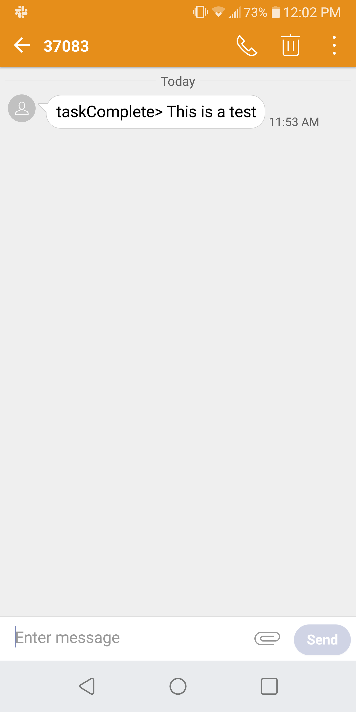

# sns
This is a basic AWS SNS using lambdas

## Setup
First create an SNS Topic.  Now you need to make a lambda function with access to SNS to subscribe to the topic.  Next you will need another lambda function with access to SNS to publish notifications.

